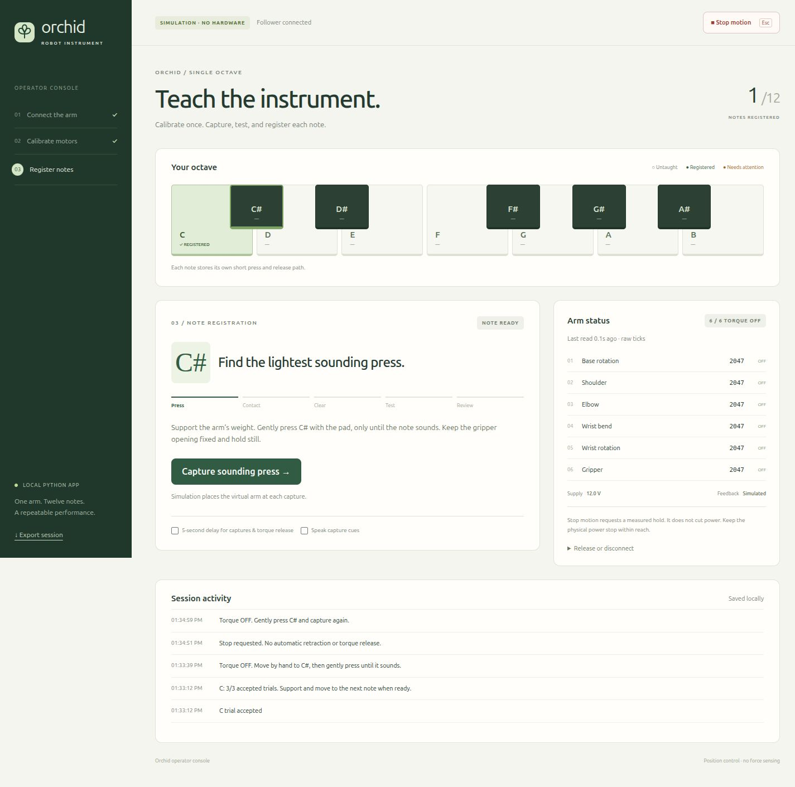
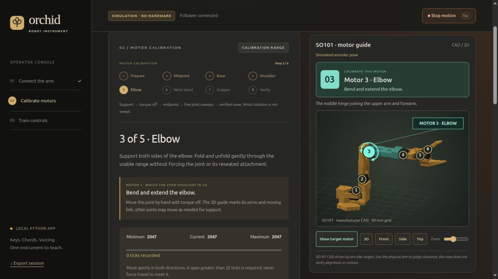

# Orchid robot instrument

A Python app with a local web interface for calibrating an SO101 follower arm and registering Orchid's **12 notes, eight chord buttons, and two voicing-dial directions**. Run the source with `python app.py`; there is no application installer, frontend build, or cloud service.

The console mirrors the instrument's charcoal surface, gold case, chord bank, voicing dial, and single-octave keyboard. It walks an operator through connection, motor calibration, teaching a local motion, and three observed trials. Simulation works without LeRobot, a serial connection, or the instrument.

**Status:** the complete workflow is covered by simulated/fake motor tests and browser checks. The new web hardware adapter still needs supervised commissioning on the repaired arm. This is position control without contact-force sensing or collision detection; registration does not establish that arbitrary motion between notes is safe.



## Teach one key fast (leader record → replay)

`teach_key.py` is a small terminal tool built directly on LeRobot 0.6.1's SO101 drivers, using LeRobot's safety baseline unchanged (calibration check, firmware joint limits, P=16 gains, gripper current limits, leader torque off). It adds a goal-at-measured-pose seed before torque enable, speed-limited ramps to start poses, hold-and-ask instead of dropping the arm on exit, and refuses recordings made under a different calibration. It has no fixture, home route or tracking-tolerance gates. Stop the web app first; both cannot own the ports.

```bash
source ~/.virtualenvs/orchid/bin/activate
python teach_key.py ports              # follower 12 V / leader 5 V, all six motors each
python teach_key.py sync-calibration   # motors' current calibration -> LeRobot's JSON files (backs up the old ones)
python teach_key.py record C           # wait for FOLLOWING; Enter, rest -> press C -> rest, Enter; q
python teach_key.py play C --speed 0.5 # Enter repeats; then try --speed 1.0
```

Recordings are `keys/<key>.json` (commanded goals, leader and measured follower poses at 30 fps). Tests: `PYTHONPATH=. ~/.virtualenvs/orchid/bin/python -m unittest discover -s tests -p test_teach_key.py`.

## Run locally

Python **3.12** on Linux or macOS (Apple silicon or Intel). On a Mac, install it first with `brew install python@3.12` (Node 22 is only needed for the JavaScript tests: `brew install node`). From the repository:

```bash
python3.12 -m venv .venv
source .venv/bin/activate
python -m pip install -r requirements.txt -c constraints-web.txt
python app.py
```

Open **http://127.0.0.1:8080** on the same computer. Installing requirements installs Python dependencies, not this project as an application. Subsequent runs only need environment activation and `python app.py`.

The default is **simulation**. All controls—including calibration sweeps, capture, test, reject, and recovery—are usable with the virtual arm. Simulated trials are labeled and stored separately from physical trials.

Options:

```bash
python app.py --port 8081
python app.py --data-dir /path/to/local/session-data
```

### macOS notes

- **Hardware environment.** LeRobot gets its own environment, as on Linux: `python3.12 -m venv ~/.virtualenvs/orchid && ~/.virtualenvs/orchid/bin/python -m pip install -r requirements-hardware.txt`. Every command in these docs that uses `~/.virtualenvs/orchid/bin/python` then works unchanged.
- **Ports.** The arms' USB adapters appear as `/dev/tty.usbmodem…` (or `/dev/tty.wchusbserial…` with WCH's CH34x driver), not `/dev/ttyACM…`. The console, `find_ports.py` and `teach_key.py ports` find them by themselves and tell follower (12 V) from leader (5 V) by voltage. No `dialout` group or serial permission step is needed. If no port appears, check the cable and USB hub, then install WCH's CH34x driver.
- **Keep the Mac awake while the arm is powered.** Sleep cuts USB, and the console then stops with a hold fault. Run it as `caffeinate -i ~/.virtualenvs/orchid/bin/python app.py --enable-hardware --port 8081`, and keep the console tab visible: a hidden tab that Safari or Chrome throttles misses heartbeats, and after five seconds the arm stops and holds.
- Calibration files live in the same place as on Linux (`~/.cache/huggingface/lerobot/calibration/`), and the Claude chime hook in `~/.claude/settings.json` can use `afplay /System/Library/Sounds/Glass.aiff` instead of `pw-play`.

## Move to another computer

Git carries the code, but not the operator state: the taught keys, home and rest poses, dial steps, speed and press settings and the motor calibrations live in `data/hardware/` (ignored by Git), and `teach_key.py` uses LeRobot's calibration files. Move them with one bundle (standard library only, works while the console runs):

```bash
python3 scripts/migrate.py export                       # old computer: orchid-state-<host>-<time>.tar.gz
python3 scripts/migrate.py inspect orchid-state-….tar.gz # new computer: what it holds and where it goes
python3 scripts/migrate.py import orchid-state-….tar.gz  # console stopped; refuses to overwrite unless --force
```

The bundle checks every file's checksum. `--logs` adds the large motion logs; `--force` moves differing files to `data/backups/before-import-<time>/` first. The motors keep their own calibration, so the imported calibrations match as long as the same two arms move with it. Taught poses only hold if the arm and Orchid are mounted exactly as before. After moving, play one key with the speed slider at 1× or lower, and re-teach (home first) if it misses.

The server binds only to `127.0.0.1`. Keep one operator tab open. A second tab can view state but cannot take control while the first tab's lease is active. Do not expose this service with a reverse proxy or remote tunnel.

## Operator workflow

The following steps describe guiding the follower by hand. For leader teaching, use the shared-home workflow below.

1. **Connect.** Check mounting, padding, and access to the power stop. Name the fixture and select rubber-covered tips or a padded gripper. Only mark the placement unchanged if the base, instrument, contact surface, and gripper opening really are unchanged.
2. **Calibrate.** Support the arm while torque releases. Capture the midpoint, then record the usable ranges of base, shoulder, elbow, wrist bend, and gripper. Wrist rotation does not require a cable-twisting sweep. Review and save; hardware writes are read back for verification.
3. **Teach a note.** With torque off, capture **hover → first contact → sounding press**. The app records the downward stroke; playback retraces **press → contact → hover** along that exact path. Keep the gripper opening fixed.
4. **Establish a hold.** **Capture press & hold** enables torque at the current supported pressed position. Clear your hands, then choose **Retreat to hover**. It runs only the reverse stroke from that position—no repeat press. Leader teaching already has a powered hold.
5. **Test and review.** Run one press, listen, and accept or reject it. Repeat the test three times from the held clearance; no repeated teaching is needed between trials.
6. **Next note.** Support the arm and choose **Release & continue**. Move to the next note by hand. Continue through C, C#, D, D#, E, F, F#, G, G#, A, A#, B.

Select the **chord bank** to teach Dim, Min, Maj, Sus, 6, m7, M7, and 9 with the same hover/contact/press workflow. Review the intended button response with a consistent reference chord and playstyle; extensions do not sound alone.

Select **CW or CCW** beside the large voicing dial to teach a separate forward loop: start clear → light rim contact → small turn → lift off → return through clear space. Rubber-covered tips keep a fixed opening and nudge the rim. The app does not close the gripper around the dial. Describe the starting reference and expected change, restore that reference before each test, and accept three observed trials per direction. These are relative gestures, not absolute dial positions. Together the instrument has **22 independently registered motions**.

Enable **5-second delay** to free both hands before capture or torque release. It defaults on in hardware mode. Spoken cues are optional and depend on browser speech support. There is no microphone requirement. Cancel the countdown before it finishes to take no action; Escape also requests a stop when connected.

Taught controls can also be played, sequenced and adjusted (press length, dial turn, the global arm speed, max 3×, also on the top-bar slider) from `python3 scripts/orchid.py` or the `orchid-keys` Claude skill while the console is open and in control; see [Play from scripts or Claude](docs/operator-guide.md#play-from-scripts-or-claude-api).

Detailed instructions: [Operator guide](docs/operator-guide.md).

## Calibration and live arm view

**Calibrate motors** in the sidebar returns to an arm picker at any point after connecting. Choose **Follower** or **Leader** to calibrate, reset or reload its separate reference. If you started with only the follower, **Leader → Find leader → Connect leader** adds the leader without disconnecting or recalibrating the follower. Powered holds require the supported release step before setup; active leader following must first be paused. Training becomes available after both required calibrations are verified.

The calibration screen has an eight-step tracker, joint-specific handling instructions, a live minimum/current/maximum display, and an automatically highlighted joint in the **3D arm view**. The instrument map moves out of the way during calibration. Five joint sweeps are recorded; wrist rotation is not swept.

**Motor status** shows all six encoder positions, torque readbacks, angles from the captured midpoint, recorded ranges, and powered target/tracking differences. Select a motor to highlight it in 3D. **Refresh volts & temperature** takes a separate health snapshot only while idle with torque off; it adds no diagnostic reads to powered motion. Each snapshot is timestamped.

The orbitable 3D view uses locally bundled manufacturer SO101 CAD: the base, brackets, six servo housings, wrist, and moving gripper jaw. Each calibration sweep automatically frames and highlights the target servo and moving link in cyan, with a numbered marker, direction arc, physical landmark, and handling cue. Midpoint capture identifies all six joints; the gripper sweep is motor **6**, because motor **5** is not swept. The guide stays beside the workflow on wide screens and appears first on narrow screens.

Drag to orbit, choose front/side/top views, or use **Show target motor** to restore the step’s view. Arrow keys and `+`/`-` also adjust the camera. These are view controls only. Before midpoint capture, the view explicitly shows a reference shape. Referenced encoder data drives the model afterward; stale feedback is labeled and the last pose freezes. WebGL renders the bundled CAD offline, with a labeled joint schematic if unavailable. Model alignment, mounting position, and rubber-tip dimensions still need physical verification, so the view is not a clearance or collision check.



## When the physical arm returns

Use the repaired SO101 follower with securely fitted rubber-covered tips or a padded gripper, serial access (Linux: the `dialout` group; macOS: nothing to set up), Python 3.12, and the pinned LeRobot interface:

```bash
python -m pip install -r requirements-hardware.txt
python app.py --enable-hardware
```

Opening the page does not connect or enable motors. Choose the follower's current port in the browser; USB names can change. Connection checks all six motor IDs, follower supply voltage, position mode, and saved calibration agreement. **Guide follower by hand** needs only the follower. **Use leader to teach** adds a separate low-voltage leader connection and calibration.

For leader teaching, <kbd>Space</kbd> presses the highlighted button at every step: **Connect arms** (ports are scanned automatically; connecting only reads), **Teach C** (the follower holds where it is, that pose becomes the shared home, and it starts following the leader after a ramp of at most 30°/s), then capture **hover**, **touch** (just touching) and **press** (just sounding). Capturing the press returns press → touch → hover → home on its own, and the key counts as taught. **Play** goes home → hover → touch → press, holds for the key's press length, and comes back the same way with smooth joint moves (45°/s peak to hover, 20°/s for the strokes, at 1×; the **Arm speed** slider in the top bar sets 0.25–3×). A beep confirms each capture; tap a ✓ point to redo it; **⌂ Home** on the map sets the arm's one home for every key, and **☾ Rest** sets a parking pose (Go to rest); between key presses the arm waits at home. If another program left the follower powered, Teach asks you to support it first (torque blinks off while LeRobot's motor settings are applied). Points store the commanded goal, so the press replays its taught depth. Dial directions are recorded and replayed forward instead (a turn must not be reversed). No tracking tolerances; goals are clipped to 15° from the measured pose (LeRobot's `max_relative_target` rule) and **Stop motion** holds the arm. Same control loop as `teach_key.py` (`orchid_demo/teach.py`); taught motions stay valid until the follower calibration changes. See [leader operator instructions](docs/operator-guide.md#teach-with-the-leader-arm).

Finish the [hardware commissioning checklist](docs/operator-guide.md#commissioning-the-repaired-arm) before a public demo. Previous terminal-taught files are preserved locally but are **not automatically imported or trusted** by the web app. A joint repair requires fresh calibration and note teaching.

## Stops, persistence, and restart

- **Stop motion** requests a hold at a fresh measured position. It never blindly retracts or switches torque off. If feedback is unavailable, the last motor target can remain active. Support the arm and use the physical power stop if needed.
- A lost operator heartbeat stops powered motion after at most five seconds plus current I/O; feedback/trajectory checks also reject stale control intervals. This is not a safety-rated emergency stop.
- Support the arm, use **Release or disconnect → Disconnect**, and rest it before stopping Python. Closing the browser or Python does not intentionally drop torque.
- State lives in `data/simulation/` or `data/hardware/`: SQLite database, calibration backup, control revisions, and trial logs. Those directories are ignored by Git. New processes always start disconnected; they never resume a movement.
- Arm faults and rejected commands are printed immediately to stdout as JSON and copied to `arm-events.jsonl` in the mode directory (5 MB per file, three rotated backups). Faults include the exception traceback, control phase, cached motor/leader feedback, failed target, and motion-log path. Cached readings are timestamped; they are not a claim that the motor is still holding.
- Use **Export session** for a readable JSON snapshot of calibration, 12 note records, ten additional control records, and recent activity. JSON export is a record, not a restore feature. For a restorable backup or a move to another computer, use `python3 scripts/migrate.py export` (see [Move to another computer](#move-to-another-computer)).
- Existing version-1 databases upgrade transactionally to version 2, preserving notes and history while adding chord/dial records. Keep a full backup before upgrading if you need to run the old app again; it cannot open version 2.
- Changing the fixture, contact tool, or calibration invalidates prior registrations. A changed glove fit or gripper opening also requires a new fixture and re-teaching. Interrupted teaching restarts from a supported torque-off pose; the app does not drive back to an old starting point.

## Development

```bash
python -m pip install -r requirements-dev.txt -c constraints-web.txt
python -m pytest -q
python -m ruff check .
# Optional JavaScript geometry checks (Node 22+; no packages to install):
node --test tests/*.test.cjs
```

For the tested web dependency snapshot, add `-c constraints-web.txt` when installing the web or development requirements. Hardware dependencies have their own requirement file; do not apply the web-only snapshot to LeRobot's separate dependency stack.

See [architecture](docs/architecture.md) and [contributing](CONTRIBUTING.md). CI runs lint and the hardware-free suite on Python 3.12 on Ubuntu and macOS.

```text
app.py                    Python entry point
orchid_demo/
  api.py                  Local HTTP interface and ownership
  engine.py               Calibration/registration state machine
  devices.py              Simulated and physical motor adapters
  telemetry.py            Read-only joint status and display-angle conversion
  motion.py               Bounded stroke controller and validation
  controls.py             Keyboard, chord, and dial motion catalog
  dial.py                 Bounded forward dial loop and validation
  storage.py              Durable local state
  static/                 HTML, CSS, browser JavaScript (no build)
tests/                    Motion, workflow, API, and adapter tests
docs/                     Operator and developer documentation
```

The 3D geometry's pinned upstream source and license are listed in [third-party notices](THIRD_PARTY_NOTICES.md). Node is used only for development checks; running the app still requires only Python and a browser.

`find_ports.py` lists the arms' ports (read-only). The earlier terminal utilities remain for history: [first-key notes](ORCHID_FIRST_KEY.md), `orchid_key.py`, `orchid_session.py`, and `orchid_calibrate.py`. Do not run a legacy controller concurrently with the web app. `repair_leader_voltage.py` is a one-off diagnostic/repair utility, not part of normal operation.
