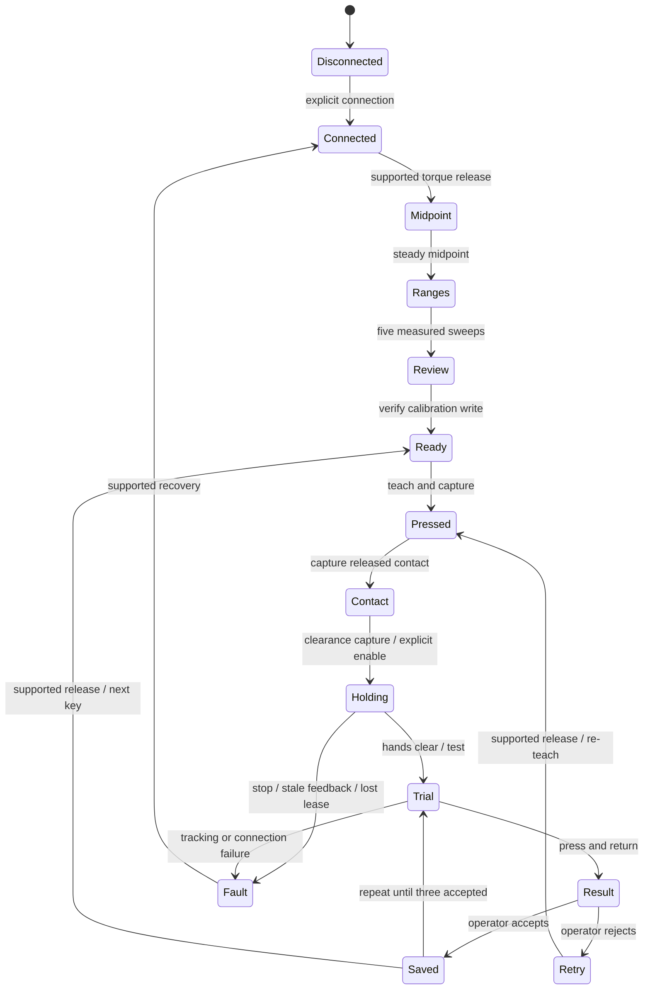

# Architecture

`app.py` launches FastAPI/Uvicorn on IPv4 loopback. The browser uses static HTML/CSS/JavaScript and a small JSON API. There is no Node dependency, asset build, package installation for the application, background service, or cloud connection. Hardware imports happen only when hardware discovery or connection is explicitly requested.

## Ownership and control

One worker thread owns the motor adapter and database writes. HTTP handlers submit validated commands to a single-slot queue and read immutable snapshots; they never issue serial commands. Command UUIDs provide bounded process-local idempotency; workflow revisions reject stale buttons and delayed commands. Only one live operator lease can submit commands. Browser heartbeat is independent of the worker, so the HTTP server can renew control during a stroke.

The lease lasts five seconds. A guarded controller checks it before each control tick and before torque enable after the stability check. Losing a lease while holding or moving causes a fault. A new owner cannot revive the old motion. Manual capture remains torque off; calibration also checks the lease. Pending command processing refuses expired ownership or commands older than five seconds.

The UI polls every 500 ms, preserving input fields and confirmation checkboxes between telemetry updates. It disables actions on connection loss or another owner, and cancels countdowns on a phase/revision change. Browser reload creates a new operator identity and requires the old lease to expire; powered work stops on takeover.

Local defenses: trusted loopback Host values, same-origin mutation checks, a per-process request token, bounded JSON command bodies, a restrictive Content Security Policy, and no cross-origin access. The app is for a trusted local OS account, not shared or remote deployment. An OS user can access this local service. Linux file locking prevents another server using the same mode directory; the hardware port also uses pyserial exclusive mode. Legacy serial programs must still be shut down separately.

## State machine

`discovery.py` is shared with `find_ports.py`: USB candidates are pinged for Feetech IDs 1–20 at 1 Mbaud, then voltage register 62 is read on the first responder. It acquires serial exclusivity before packet traffic, uses bounded serial writes and monotonic packet deadlines, closes each adapter, and checks cancellation/ownership between reads. Nonresponding serial devices are omitted; busy adapters produce warnings. The authenticated `refresh_ports` command runs only in the disconnected phase on the motor worker. GET `/api/ports` and state polling return cached results without serial I/O. Simulation never imports or invokes discovery. Scan failure invalidates old results. Eligibility requires IDs 1–6, a valid voltage, and an inferred follower role; hardware connection still revalidates all six voltages and modes.

The exact phases and guards are in `engine.py`. Calibration snapshots hardware and EEPROM lock state before changes; failed writes attempt rollback/readback. Wrist-roll range is 0..4095; five other joint ranges are recorded individually. The hardware adapter uses `FeetechMotorsBus.connect()`, not `robot.connect()` or `robot.configure()` (which could enable torque).

Midpoint capture uses the Feetech relationship `Present_Position = Actual_Position - Homing_Offset`: `(present + old_offset) % 4096 - 2047` yields the new offset without resetting the reference and immediately reading in a potentially transitional frame. It verifies all offset registers, then checks at most twelve position samples 50 ms apart. Three consecutive samples must stay within the original ±3 tick midpoint bound and a 2-tick span. Torque-off readback, feedback deadlines, and operator/stop guards remain active; mismatches identify the joint, value, and spread before rollback. Hardware adapters are tested with delayed feedback, offset write failure, motion, and cancellation; physical commissioning is still required.

The browser's safety confirmations use native `aria-pressed` toggle buttons with large touch targets. They do not submit commands. The action below consumes confirmation into its existing boolean command arguments; cancellation or rejection requires a new confirmation. Workflow changes, lost ownership, and lost connectivity reset confirmations, including recovery consent. Server-side support and workflow checks remain authoritative.

The calibration presentation adds a preparation/midpoint/five-sweep/verification tracker and per-joint guidance without moving calibration into the browser. Recalibration clears the previous midpoint/range presentation before capture. Simulation sweeps expose intermediate virtual positions so the view updates during a rehearsal.

## Telemetry and 3D presentation

`telemetry.py` derives motor cards and model angles from the worker's existing measured positions, torque flags, calibrated ranges, and latest powered target. No additional serial reads occur in `publish()` or HTTP handlers. Non-gripper angles use `(raw - 2047) * 2π / 4096`, not normalized travel. The model jaw interpolates the calibrated gripper range into its nominal joint limits and is explicitly approximate. No model angles are presented until a current midpoint or verified calibration exists; prior calibrated bounds are not reused during a new calibration.

`refresh_diagnostics` is accepted only in connected/ready phases and reads voltage/temperature only with all six motors verified torque off. It uses the same worker, never a second bus owner. Results are timestamped and cleared on failure/reconnect; they are never treated as motion safety inputs. Health reads are excluded from calibration and all powered/capture phases. A failed optional health read reports unavailable without initiating a motor action.

The static `arm-geometry.js` table and `arm-visuals.js` CAD data come from a pinned, attributed Apache-2.0 SO101 URDF and its mesh assets. `scripts/build_so101_visuals.py` uses only the Python standard library to cluster and quantize the display meshes; thirteen meshes are reused in seventeen visual placements. `arm-model.js` applies parent × joint-origin RPY × local-Z joint rotation transforms. `arm-renderer.js` places each visual within the correct link frame and draws shaded, depth-tested CAD into an offscreen WebGL canvas, composited under 2D motor markers and direction arcs. Context loss or unavailable WebGL uses a clearly labeled joint schematic. No network CDN or frontend package build is needed.

`arm-guide.js` is a pure mapping from workflow phase to motor ID, cue, physical landmark, and camera preset. It targets all six joints for midpoint/review and physical IDs 1, 2, 3, 4, 6 for the five sweeps. Servo highlights follow the **parent** link containing each motor; moving printed parts follow its child link. New targets frame automatically; manual camera changes persist between telemetry polls. Draws are coalesced with animation frames. Tests validate motor mapping, visual frames, mesh indices/bounds, and separate jaw articulation. These modules never submit API commands or feed geometry into the motion controller. Stale feedback freezes the last model pose and changes its label. The browser model is an unverified geometric estimate, not a world-aligned robot twin or collision model.

Each taught stroke stores six raw encoder positions per waypoint, a contact index, calibration fingerprint, fixture identity, mode, and verification count. Teaching records the release from minimum sounding press to first contact to clearance. The reverse path becomes the downstroke. The gripper goal stays fixed. There is no Cartesian planner, collision model, force feedback, automatic key-to-key route, or powered approach from an arbitrary pose.

`controls.py` defines twelve keyboard targets, eight case-sensitive chord-button targets, and two relative dial directions. Chord buttons reuse the bounded press controller. The UI selects a target without moving hardware; starting any target requires supported torque release. Advancing stays within its group. Contact-tool selection is part of fixture identity, so changing between a pad and rubber-covered tips invalidates prior registrations.

`dial.py` validates and executes a forward loop: start clearance → rim contact → turn → lift-off → clear return. Explicit ordered contact/turn/release markers are required. The return must end within six ticks of the initial clearance before supported torque enable. Contact-to-lift motion stays within the existing 36-tick contact bound; grip, adjacent sample, calibrated range, local envelope, tracking, I/O, lease, and trial-duration checks also apply. The controller aligns at clearance and follows this loop once, never automatically reversing the turn path. Direction, rim clearance, reference reset before each trial, and observed musical effect require operator confirmation. There is no dial-angle/detent sensor or automatic gripper-closing sequence. Both directions need three accepted trials.

## Motion limits

`motion.py` contains the original tested position controller. Current defaults are conservative software bounds, not physically certified limits:

| Check | Default |
| --- | --- |
| Control period | 50 ms |
| Maximum I/O or loop gap | 250 ms |
| Maximum adjacent taught sample gap | 24 ticks |
| Maximum local stroke excursion | 120 ticks |
| Maximum contact stroke | 36 ticks |
| Maximum tracking error | 8 ticks |
| Gripper tolerance | 3 ticks |
| Working margin from calibrated ends | 16 ticks |
| Speed / acceleration | 24 ticks/s / 80 ticks/s² |
| Single trial limit | 45 s |

A stop attempts a measured-position hold using fresh feedback inside the taught envelope. It never issues a blind retract and never drops torque automatically. If that read/write fails, the previous motor target can remain active. OS scheduling, serial I/O, mechanical faults, and missing force sensing prevent any safety-rated guarantee.

## Persistence and migration

SQLite runs in WAL mode with synchronous FULL. Note/control replacement and the corresponding archive event are transactional. Simulation and hardware use separate databases; API commands cannot switch mode. A process starts disconnected, even with saved registrations. Fixture or calibration mismatches mark registrations for re-teaching.

The database stores calibration, a pre-calibration backup, fixture identity/contact tool, the latest draft, accepted control revisions, and event history. A JSONL file records targets and feedback for powered trials/holds. Export contains the current calibration, fixture, 12 note slots, ten additional control slots, and recent activity. Full historical revisions and trial logs remain in the local directory; export is not a restoration interface. Schema version 2 adds a separate `controls` table, preserving the twelve-slot `notes` contract. Version 1 upgrades in a transaction without rewriting note/history records; unknown versions fail rather than being overwritten. An old version-1 app cannot read a version-2 database.

If Python is killed mid-calibration, automatic rollback cannot be guaranteed. The backup remains on disk and motor mismatch prevents note use; operators should complete a new calibration before teaching. Never restore an old database and assume its calibration still matches motor EEPROM.

Existing terminal tools import `orchid_key` through a compatibility wrapper around `orchid_demo.motion`; their command syntax and root-level map defaults are retained. Legacy key maps are not imported automatically because their geometry may predate the mechanical repair.

## Validation boundaries

Tests cover the original motion limits plus the full 12-key/36-trial simulated workflow, all eight chord buttons, both dial directions, forward-loop ordering, missing lift-off, unsafe return/contact paths, changed grips, required reset/effect confirmations, command freshness/idempotency, lost leases, tracking failures, interrupted handover, calibration rollback, changed contact tools, invalidated records, restart, schema-1 migration, mode isolation, local HTTP security, and no automatic hardware connection. Browser checks cover calibration, press registration, dial capture/review, and responsive layout. Hardware adapter tests use a fake bus; passing them does not validate physical timing, loads, clearance, or contact pressure.

Telemetry tests cover midpoint gating, stale/fault target removal, prior-range invalidation, limit labels, degree/radian conversion, jaw mapping, and idle-only diagnostic reads and failures. Six Node tests check URDF transform order, units, base rotation, link lengths, and the jaw branch. Node is a development/CI dependency only; the Python app serves the JavaScript directly.
