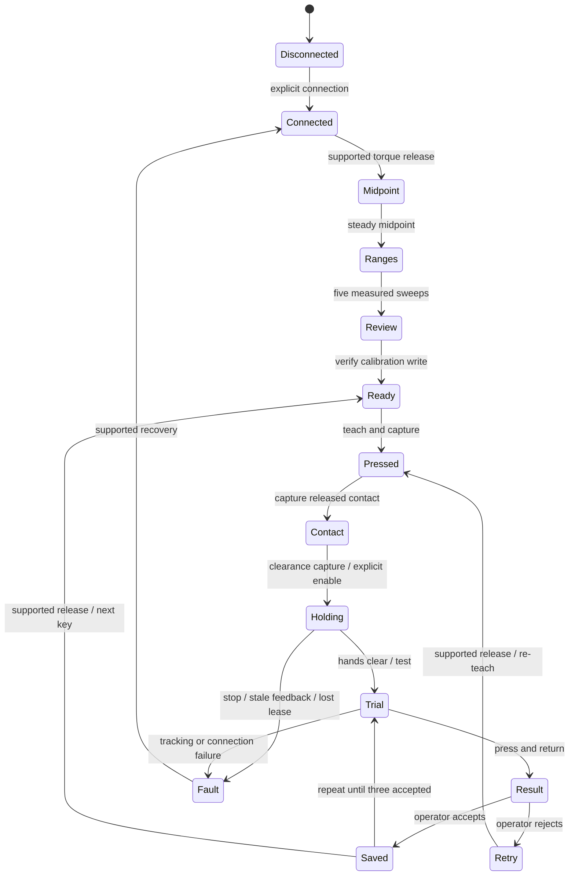

# Architecture

`app.py` launches FastAPI/Uvicorn on IPv4 loopback. The browser uses static HTML/CSS/JavaScript and a small JSON API. There is no Node dependency, asset build, package installation for the application, background service, or cloud connection. Hardware imports happen only when hardware connection is explicitly requested.

## Ownership and control

One worker thread owns the motor adapter and database writes. HTTP handlers submit validated commands to a single-slot queue and read immutable snapshots; they never issue serial commands. Command UUIDs provide bounded process-local idempotency; workflow revisions reject stale buttons and delayed commands. Only one live operator lease can submit commands. Browser heartbeat is independent of the worker, so the HTTP server can renew control during a stroke.

The lease lasts five seconds. A guarded controller checks it before each control tick and before torque enable after the stability check. Losing a lease while holding or moving causes a fault. A new owner cannot revive the old motion. Manual capture remains torque off; calibration also checks the lease. Pending command processing refuses expired ownership or commands older than five seconds.

The UI polls every 500 ms, preserving input fields and confirmation checkboxes between telemetry updates. It disables actions on connection loss or another owner, and cancels countdowns on a phase/revision change. Browser reload creates a new operator identity and requires the old lease to expire; powered work stops on takeover.

Local defenses: trusted loopback Host values, same-origin mutation checks, a per-process request token, bounded JSON command bodies, a restrictive Content Security Policy, and no cross-origin access. The app is for a trusted local OS account, not shared or remote deployment. An OS user can access this local service. Linux file locking prevents another server using the same mode directory; the hardware port also uses pyserial exclusive mode. Legacy serial programs must still be shut down separately.

## State machine

The exact phases and guards are in `engine.py`. Calibration snapshots hardware and EEPROM lock state before changes; failed writes attempt rollback/readback. Wrist-roll range is 0..4095; five other joint ranges are recorded individually. The hardware adapter uses `FeetechMotorsBus.connect()`, not `robot.connect()` or `robot.configure()` (which could enable torque).

Each taught stroke stores six raw encoder positions per waypoint, a contact index, calibration fingerprint, fixture identity, mode, and verification count. Teaching records the release from minimum sounding press to first contact to clearance. The reverse path becomes the downstroke. The gripper goal stays fixed. There is no Cartesian planner, collision model, force feedback, automatic key-to-key route, or powered approach from an arbitrary pose.

## Motion limits

`motion.py` contains the original tested position controller. Current defaults are conservative software bounds, not physically certified limits:

| Check | Default |
| --- | --- |
| Control period | 50 ms |
| Maximum I/O or loop gap | 250 ms |
| Maximum adjacent taught sample gap | 24 ticks |
| Maximum local stroke excursion | 120 ticks |
| Maximum contact stroke | 36 ticks |
| Maximum tracking error | 8 ticks |
| Gripper tolerance | 3 ticks |
| Working margin from calibrated ends | 16 ticks |
| Speed / acceleration | 24 ticks/s / 80 ticks/s² |
| Single trial limit | 45 s |

A stop attempts a measured-position hold using fresh feedback inside the taught envelope. It never issues a blind retract and never drops torque automatically. If that read/write fails, the previous motor target can remain active. OS scheduling, serial I/O, mechanical faults, and missing force sensing prevent any safety-rated guarantee.

## Persistence and migration

SQLite runs in WAL mode with synchronous FULL. Note replacement and the corresponding archive event are transactional. Simulation and hardware use separate databases; API commands cannot switch mode. A process starts disconnected, even with saved notes. Fixture or calibration mismatches mark registrations for re-teaching.

The database stores calibration, a pre-calibration backup, fixture identity, the latest draft, accepted note revisions, and event history. A JSONL file records targets and feedback for a note's powered trials/holds. Export contains the current calibration, fixture, 12 note slots, and recent activity. Full historical revisions and trial logs remain in the local directory; export is not a restoration interface. Schema version 1 is checked on startup; unknown versions fail rather than being overwritten.

If Python is killed mid-calibration, automatic rollback cannot be guaranteed. The backup remains on disk and motor mismatch prevents note use; operators should complete a new calibration before teaching. Never restore an old database and assume its calibration still matches motor EEPROM.

Existing terminal tools import `orchid_key` through a compatibility wrapper around `orchid_demo.motion`; their command syntax and root-level map defaults are retained. Legacy key maps are not imported automatically because their geometry may predate the mechanical repair.

## Validation boundaries

Tests cover the original motion limits plus the full 12-key/36-trial simulated workflow, command freshness/idempotency, lost leases, tracking failures, interrupted handover, calibration rollback, invalidated records, restart, mode isolation, local HTTP security, and no automatic hardware connection. Browser checks cover the actual calibration and note registration flow. Hardware adapter tests use a fake bus; passing them does not validate physical timing, loads, clearance, or contact pressure.
